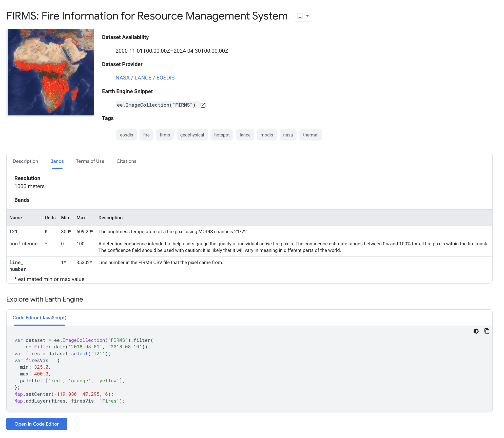

# tooling_around
 
This repository contains script examples for modeling "Sample Code" for accessing data in Earthworks, from popular analysis platforms, ala Planet.com's Explorer and the Google Earth Engine Data Catalogue. 

Planet.com and Google Earth Engine auto-generate cut-and-paste code for immediate use of identified datasets of interest. 

In this example, you see the sample code snippet for the FIRMS Fire dataset in Google Earth Engine:



This code is bespoke, and created by Google Engineers as part of process of accessioning new datasets into the GEE ecosystem.

```javascript
var dataset = ee.ImageCollection('FIRMS').filter(
    ee.Filter.date('2018-08-01', '2018-08-10'));
var fires = dataset.select('T21');
var firesVis = {
  min: 325.0,
  max: 400.0,
  palette: ['red', 'orange', 'yellow'],
};
Map.setCenter(-119.086, 47.295, 6);
Map.addLayer(fires, firesVis, 'Fires');
```

If you have a Google Earth Engine Account, you can launch this sample code and run it in the code editor by clicking on the button (which links to):

https://code.earthengine.google.com/?scriptPath=Examples:Datasets/FIRMS/FIRMS

