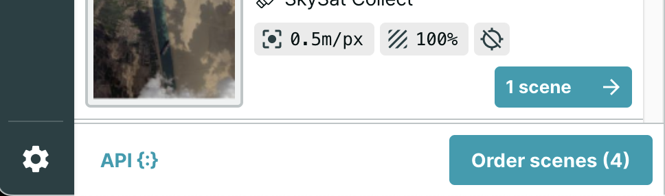
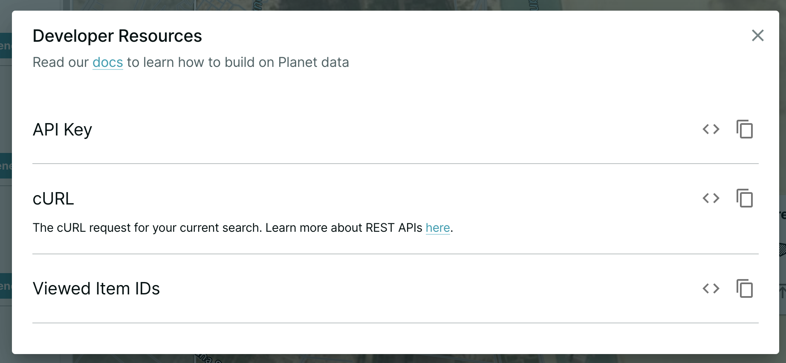
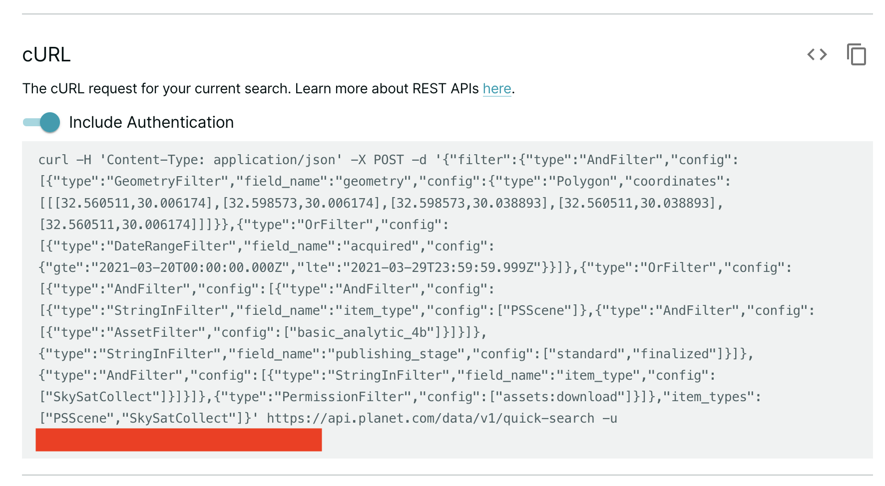
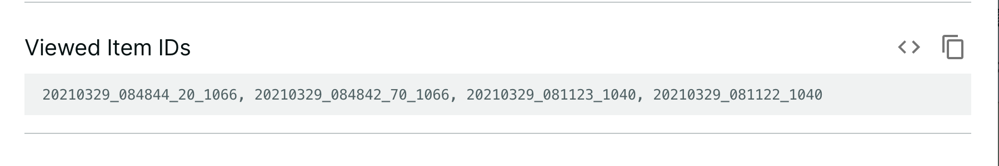

# tooling_around
 
This repository contains script examples for modeling "Sample Code" for accessing data in Earthworks, from popular analysis platforms, ala Planet.com's Explorer and the Google Earth Engine Data Catalogue. 

Planet.com and Google Earth Engine auto-generate cut-and-paste code for immediate use of identified datasets of interest. 

### Cloud Optimized Geotiff from Stacks URL to Leaflet.js

This example shows a cloud optimized geotiff, served from a stacks URL, displayed in a Leaflet Map:

* [HTML document](https://github.com/StanfordGeospatialCenter/tooling_around/blob/e48188d08aa036fd32bdbd9868e8747cb18139b6/script_examples/stacks_cog_leaflet.html)
* [Live example](https://web.stanford.edu/~maples/earthworks/cog_leaflet.html)

### Geoserver WFS GeoJSON in Leaflet.js

This example shows a GeoJSON file, served from Stanford's Geoserver, in a Leaflet.js Map:

* [HTML document](https://github.com/StanfordGeospatialCenter/tooling_around/blob/e48188d08aa036fd32bdbd9868e8747cb18139b6/script_examples/clowns_Leaflet.html)
* [Live example](https://web.stanford.edu/~maples/earthworks/wfs_clowns_leaflet.html)

### GeoJSON from Stacks URL in Leaflet.js

This example show a GeoJSON file, loaded from a Stacks URL to Leaflet.js

* [HTML document](https://github.com/StanfordGeospatialCenter/tooling_around/blob/250100ad158feac31dee4de472a403b3d2697dc6/script_examples/stacks_clowns_Leaflet.html)
* [Live example](https://web.stanford.edu/~maples/earthworks/stacks_clowns_leaflet.html)

### Examples in Python Notebook

This Colab Notebook shows examples of loading GeJSON from a Geoserver WFS, GeoJSON from a Stacks URL and loading a COG from a STACKS URL:

* importsinPython.ipynb in Github
* [Live importsinPython.ipynb in Colab](https://colab.research.google.com/drive/1BChnBeilRiW3acoU36iYnM_7hlxoQpkO?usp=sharing)


# Other Sample Code Examples
## Google Earth Engine Data Catalog Sample Code

In this example, you see the sample code snippet for the FIRMS Fire dataset in Google Earth Engine:


This code is bespoke, and created by Google Engineers as part of process of accessioning new datasets into the GEE ecosystem.

```javascript
var dataset = ee.ImageCollection('FIRMS').filter(
    ee.Filter.date('2018-08-01', '2018-08-10'));
var fires = dataset.select('T21');
var firesVis = {
  min: 325.0,
  max: 400.0,
  palette: ['red', 'orange', 'yellow'],
};
Map.setCenter(-119.086, 47.295, 6);
Map.addLayer(fires, firesVis, 'Fires');
```

If you have a Google Earth Engine Account, you can launch this sample code and run it in the code editor by clicking on the button (which links to):

https://code.earthengine.google.com/?scriptPath=Examples:Datasets/FIRMS/FIRMS

## Planet.com Explorer Sample Code

Planet.com's Explorer application uses a "Shopping Cart" model for searching and selecting imagery for download. Once you have added images to your shopping cart...


You can click on the `API{:}` button at the bottom of the search panel to reveal options for code-based loading, which are auto-generated, on-the-fly:



which results in 3 options:

1. Copy your API Key



2. A Cut&Paste cURL command for downloading data directly (API key Obscured):



3. or Item IDs, for cut&paste to R or Python Scripts:

